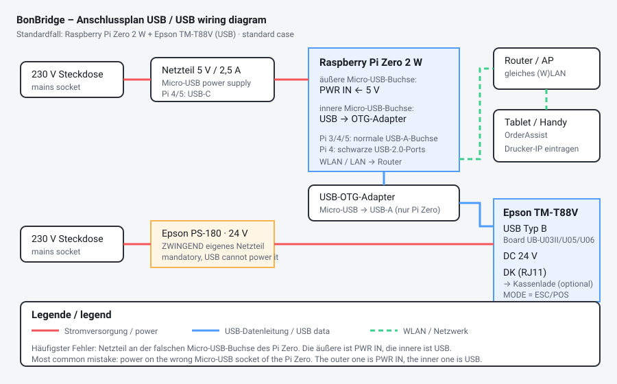

# Anschlusspläne



## 1. Standardfall: USB

```
   ┌────────────────────┐              ┌──────────────────────────┐
   │  Steckdose 230 V   │              │   Steckdose 230 V        │
   └─────────┬──────────┘              └───────────┬──────────────┘
             │                                     │
   ┌─────────▼──────────┐              ┌───────────▼──────────────┐
   │ Netzteil 5 V/2,5 A │              │ Epson PS-180  24 V       │
   │ (Pi Zero: Micro-USB│              │ ZWINGEND eigenes Netzteil│
   │  Pi 4/5: USB-C)    │              │ USB liefert nicht genug  │
   └─────────┬──────────┘              └───────────┬──────────────┘
             │ an Buchse "PWR IN"                  │ DC-Stecker
   ┌─────────▼───────────────────────┐             │
   │  Raspberry Pi Zero 2 W          │  ┌──────────▼───────────────┐
   │                                 │  │  Epson TM-T88V           │
   │  Buchse "USB" (innere) ─────────┼──┤  USB Typ B (UB-U03II/U05)│
   │        │                        │  │                          │
   │        └─ USB-OTG-Adapter       │  │  DK-Buchse (RJ11) ───────┼──▶ Kassenlade
   │           Micro-USB → USB-A     │  │  MODE muss ESC/POS sein  │      (optional)
   │           + Kabel USB-A → USB-B │  └──────────────────────────┘
   │                                 │
   │  WLAN ──────────────────────────┼──▶ Router ──▶ Tablet/Handy (OrderAssist)
   └─────────────────────────────────┘
```

### Die drei häufigsten Fehler

1. **Netzteil an der falschen Buchse.** Der Pi Zero hat zwei gleich aussehende
   Micro-USB-Buchsen. Die **äußere** (näher an der Ecke) ist `PWR IN`, die
   **innere** ist `USB`. Vertauscht: Der Pi startet nicht oder der Drucker wird
   nie erkannt.
2. **Kein 24-V-Netzteil am Drucker.** Ohne eigene Stromversorgung meldet sich
   der Drucker gar nicht am USB. `lsusb` zeigt dann schlicht nichts.
3. **Passiver USB-Hub dazwischen.** Direkt anstecken. Wenn ein Hub sein muss,
   dann einer mit eigenem Netzteil.

### Prüfen, ob die Verkabelung stimmt

```bash
lsusb                    # Drucker sichtbar?
ls /dev/usb/             # lp0 vorhanden? (nicht bei allen Modellen, siehe unten)
dmesg | tail -n 20       # was sagt der Kernel beim Einstecken?
bonbridge scan           # was sieht BonBridge?
```

> **Wichtig:** Ein fehlendes `/dev/usb/lp0` bedeutet **nicht**, dass etwas kaputt
> ist. Epson-Modelle wie der TM-M244A oder die TM-m30-Familie melden sich
> vendor-spezifisch oder als `/dev/ttyACM0`. BonBridge nutzt in diesem Fall
> libusb und funktioniert trotzdem. Genau daran ist die alte
> `socat`-Lösung gescheitert.

## 2. Kein Pi nötig: Drucker mit Netzwerkschnittstelle

```
Tablet mit OrderAssist ──WLAN──▶ Router ──LAN──▶ Epson TM-T88V mit UB-E04
                                                  Port 9100
```

Wenn der Drucker ein UB-E04 (Ethernet) oder UB-R04 (WLAN) Board bekommt,
braucht es keine Bridge. BonBridge kann in diesem Fall trotzdem als reines
Überwachungsgerät laufen (Transport `network`), um Status und Diagnose zu
liefern.

## 3. Seriell (Epson UB-S01, alte Drucker, ESP32-Experimente)

```
   ESP32 / Pi-UART (3,3 V)          MAX3232 (3,3 V-Version!)      UB-S01 (DB25 / DB9)
   TXD  ─────────────────────▶  T1IN   T1OUT ────────────────▶  RXD   (DB9 Pin 2)
   RXD  ◀─────────────────────  R1OUT  R1IN  ◀────────────────  TXD   (DB9 Pin 3)
   GND  ──────────────────────── GND ─────────────────────────  GND   (DB9 Pin 5)
   3,3 V ─────────────────────── VCC
                                 C1..C4 = 100 nF Ladungspumpen-Kondensatoren
```

* **Niemals** TTL-Pegel direkt an RS-232 anschließen. RS-232 arbeitet mit
  ±12 V und zerstört ESP32- oder Pi-Pins sofort.
* Achte auf die **3,3-V-Variante** des MAX3232 (nicht MAX232, der ist 5 V).
* Baudrate und Handshake müssen zwischen DIP-Schaltern des UB-S01 und der
  Konfiguration übereinstimmen. Epson-Werkseinstellung ist meist
  **38400 8N1 mit DTR/DSR**.
* DB9 vs. DB25: Die Pinnummern oben gelten für DB9. Beim DB25-Stecker sind es
  RXD = Pin 3, TXD = Pin 2, GND = Pin 7.

Konfiguration in BonBridge:

```yaml
transport:
  type: serial
  device: /dev/ttyS0        # oder /dev/ttyUSB0
  baudrate: 38400
  dsrdtr: true
```

## 4. Mehrere Drucker an einem Gerät

Zwei Drucker per USB an einen Pi 4, jeder mit eigener IP-Adresse auf Port 9100 –
siehe [07-ausdruckgruppen.md](07-ausdruckgruppen.md).

```
                       ┌── USB ──▶ Drucker Küche   (bindet an 192.168.1.51:9100)
Pi 4 ──── LAN ─────────┤
                       └── USB ──▶ Drucker Theke   (bindet an 192.168.1.52:9100)
```

## 5. Kassenlade

Die Kassenlade wird **nicht** am Pi angeschlossen, sondern mit einem
RJ11/RJ12-Kabel an der `DK`-Buchse des Druckers. BonBridge löst sie über den
ESC/POS-Befehl `ESC p` aus – in der Weboberfläche unter *Funktionen →
Kassenlade öffnen* testbar.
