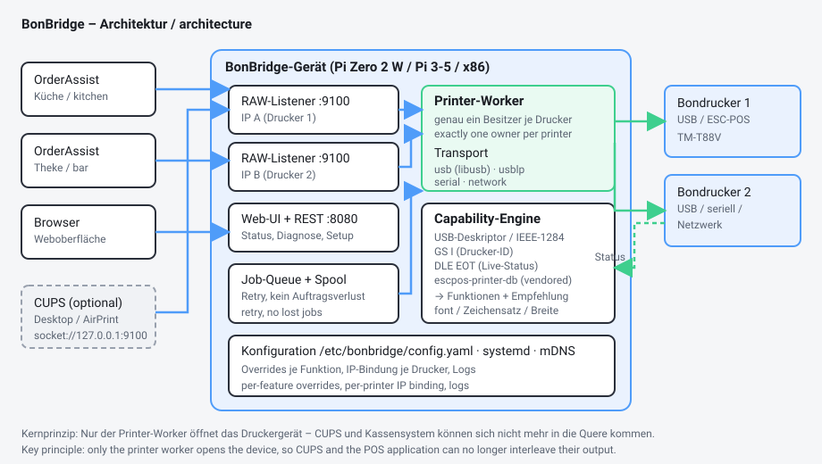

# Architecture

## Guiding principle

**Exactly one process owns the printer.**

This project's predecessor let CUPS and `socat` write to `/dev/usb/lp0` in
parallel. Both could inject into the same ESC/POS stream, and because
`socat -u` is unidirectional nobody could tell whether anything had printed at
all. BonBridge inverts that: one worker thread per printer opens the device;
everybody else hands it jobs through a queue.

## Components

| Module | Responsibility |
|---|---|
| `daemon.py` | Wires everything together, holds state, answers the web layer |
| `raw_server.py` | TCP listener on port 9100, one per printer and IP |
| `jobs.py` | Job queue, worker thread, spooling, retry |
| `transports/` | `usb` (libusb), `usblp`, `serial`, `network` |
| `caps.py` | Identification and feature detection |
| `escpos.py` | Command constants, status decoding, test pages |
| `web/server.py` | HTTP server and REST API (standard library only) |
| `mdns.py` | Avahi service file and optional Zeroconf |
| `discovery.py` | Experimental ENPC responder (Epson discovery) |
| `sysinfo.py` | System information for diagnostics and the support report |
| `config.py` | YAML configuration with complete defaults |

## Data flow of one receipt

1. The POS application opens a TCP connection to `<ip>:9100`.
2. `raw_server` reads the stream. A job ends when the connection is closed
   **or** nothing arrives for 0.4 s. This handles both
   "connect - send - disconnect" and permanently open connections.
3. The job enters the queue of the responsible worker as a `Job`.
4. The worker makes sure the transport is open (reconnecting with exponential
   backoff if needed), writes the optional preamble, the raw data and the
   optional postamble (feed, cut, cash drawer).
5. Success: counters advance, the job appears in the diagnostics list, the
   spooled copy is deleted. Anything the printer sends back is forwarded to
   the originating connection - which is what a real JetDirect interface does.
6. Failure: the job is spooled and retried after `retry_seconds`.

## Why Python and no web framework

* Python 3 is installed on Raspberry Pi OS and Debian anyway.
* `pyusb`, `pyserial` and `PyYAML` exist as Debian packages
  (`python3-usb`, `python3-serial`, `python3-yaml`) - no `pip`, no compiler,
  no virtualenv, no PyPI dependency at install time.
* The web server is built on `http.server`. For a device serving a handful of
  requests per minute a framework is dead weight - on a Pi Zero every avoided
  dependency counts at start-up.
* The web interface is a single HTML file with plain JavaScript. No build
  step, no CDN, works without internet access.

## Feature detection in four stages

1. **Identity** - USB descriptor (vendor/product/serial), IEEE-1284 device ID
   from sysfs, ESC/POS `GS I` (model, type, ROM version).
2. **Profile** - matched against the bundled `escpos-printer-db` (about 50
   models) and this project's own profiles under `profiles/`. Matching by USB
   product string or an explicit USB ID.
3. **Live status** - `DLE EOT 1..4` gives paper, cover, cutter and error
   states. Optionally `GS a` (Automatic Status Back).
4. **Active probes** - cutter, cash drawer, buzzer. Only on request, because
   they consume paper.

The result is an object where every feature carries three values: *detected*,
*override*, *effective*. The web interface shows all three so it stays
traceable where a value came from.

## Independence from third-party repositories

Installing requires only:

* this project's own GitHub repository (or a downloaded archive), and
* standard Debian packages.

Two third-party components are **vendored** into `vendor/`:

| Component | Source | Licence | Used for |
|---|---|---|---|
| `zj-58` | [klirichek/zj-58](https://github.com/klirichek/zj-58) | [BSD-2-Clause](https://github.com/klirichek/zj-58/blob/master/LICENSE) | CUPS filter, only for the optional CUPS module |
| `escpos-printer-db` | [receipt-print-hq/escpos-printer-db](https://github.com/receipt-print-hq/escpos-printer-db) | [CC BY 4.0](https://github.com/receipt-print-hq/escpos-printer-db/blob/master/LICENSE.md) | Model and capability database |

Both licences permit redistribution. `vendor/*/VENDORED_COMMIT` records which
upstream revision the copy was taken from.

**Full list with call sites:** [09-references.md](09-references.md) - it names,
for every library, specification and ESC/POS command, where in the project it
is used. Machine-readable short version in [`NOTICE`](../../NOTICE).

So if either project disappeared from GitHub tomorrow, BonBridge would remain
installable and functional.

## Security notes

* The web interface has **no password** (a deliberate decision for a device on
  the local network). Do not forward port 8080 to the internet.
* The service runs as `root` because it needs direct USB access. The systemd
  unit constrains it with `NoNewPrivileges`, `ProtectHome` and
  `ReadWritePaths`.
* Unlike the previous solution, `/etc/cups/cupsd.conf` is **not** touched.
  CUPS is optional and gets its own queue that prints through BonBridge.

## Versioning

* Semantic versioning, git tags of the form `v1.2.3`.
* A tag triggers a GitHub Actions release with a
  `bonbridge-<version>.tar.gz` attached for offline installation.
* `install.sh` installs from `main` by default; use `--branch v1.2.3` for a
  pinned version.
